# HDFS-Lab
En este laboratorio vamos a crear un cluster EMR con la interfaz de aws que nos ayuda y facilita la configuración del cluster y sus aplicaciones que usaremos para añadir, leer y procesar los datos que vamos a guardar en nuestro cluster. A continuación mostraremos el paso a paso de la realización del laboratorio 0 y posteriormente la del laboratorio 1. 

## Lab 0 - (Creación del cluster)
Como primer paso para la creación del cluster, es necesario ingresar a AWS e ir al apartado de EMR. Hay un botón que dice Crear Cluster, vamos a opciones avanzadas y ponemos las siguientes configuraciones. 

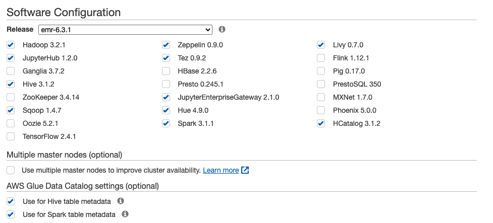

Más adelante copiamos un fragmento de codigo para configurar la persistencia de los datos de notebook en s3 con jupyter, adicionalmente le agregamos el nombre del bucket que vamos a crear y este debe coincidir y ser único.

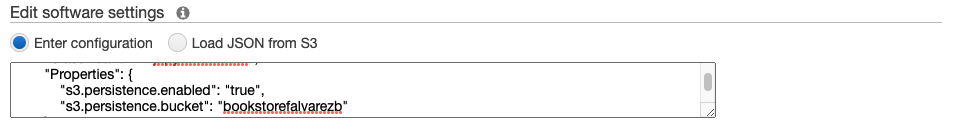

Le damos continuar, y debemos cambiar el tipo de instancia que usaremos para el cluster que por defecto utiliza m5.xlarge, sin embargo son instancias que son muy pesadas y se comen los creditos muy rapidamente, es por eso que debemos cambiar el tipo de instancia a m4.xlarge debido a que son más economicas. 

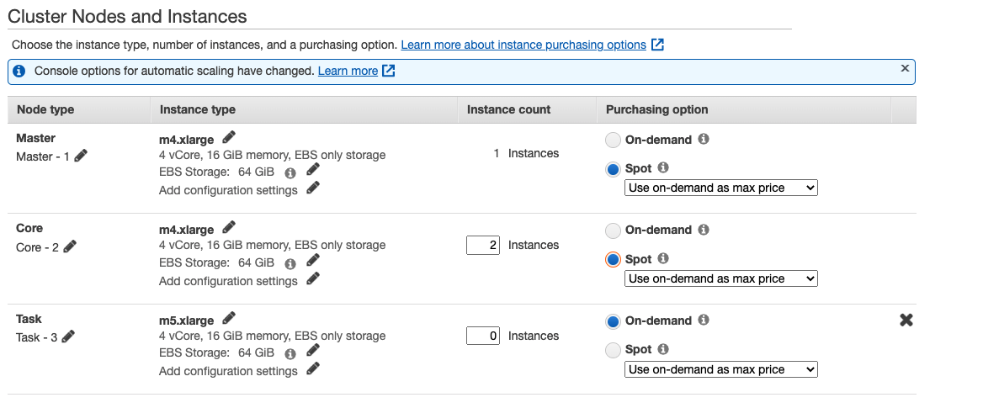

Avanzando un poco más y ya para finalizar le seleccionamos el par de claves que queremos usar para conectarnos al cluster. Seleccionamos las que tenemos y le damos crear cluster. 

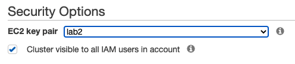

Esperamos aproximadamente unos 25 minutos y ya tendremos nuestro cluster creado

Si se termina el cluster, simplemente clonamos el cluster que se terminó y se lanza nuevamente igual al que hemos creado anteriormente. 

### Agregado 

El bucket que hemos creado en el apartado de s3 de aws llamado 'bookstorefalvarezb'

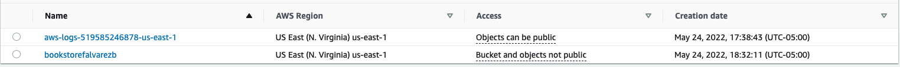

## HUE
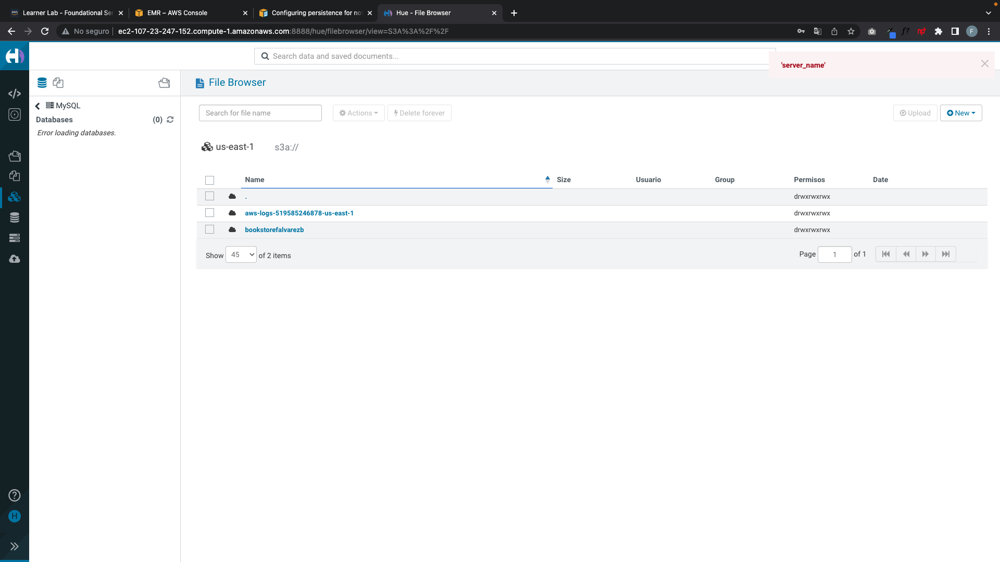

## Jupyter 
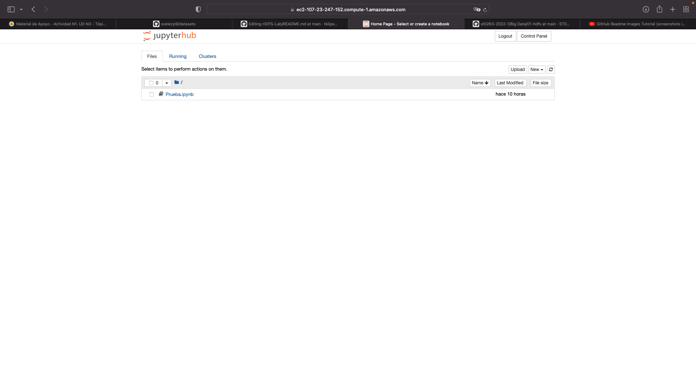

## Zeppelin
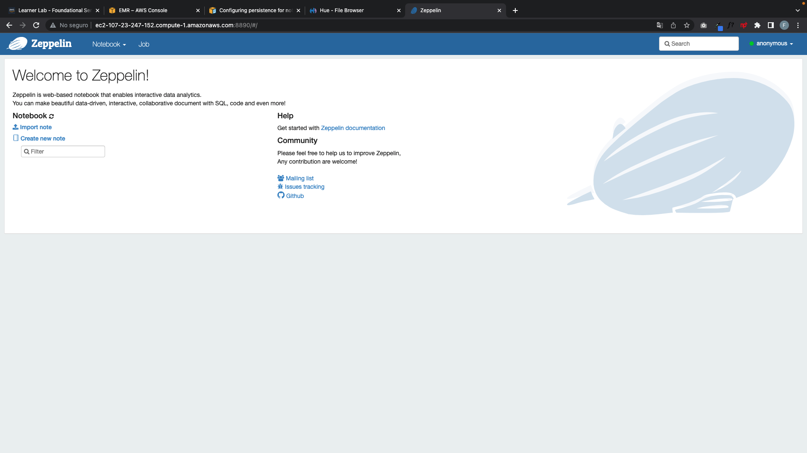

## Comprobación de conexión SSH
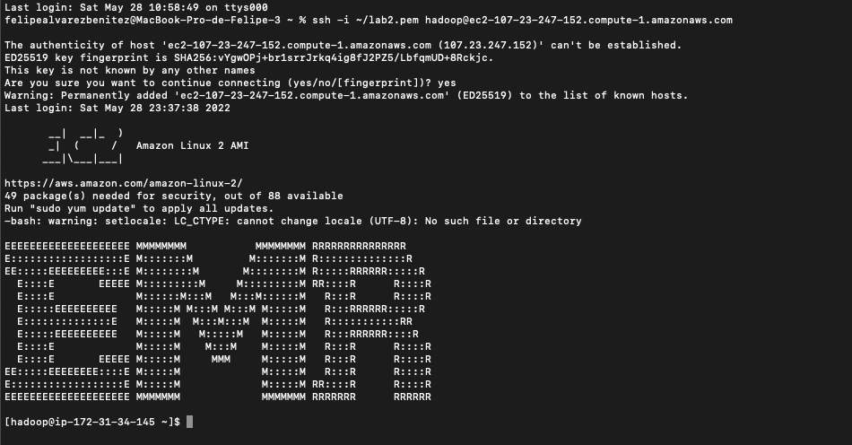

## Gestión de Archivos Vía HUE 
Primero ingresamos a HUE, creamos una cuenta que tiene de username: hadoop. Una vez vamos a los archivos y al directorio de archivos, creamos la siguiente ruta /user/hadoop/datasets/onu y ahí es que ingresamos los archivos con la informacion  y queda así

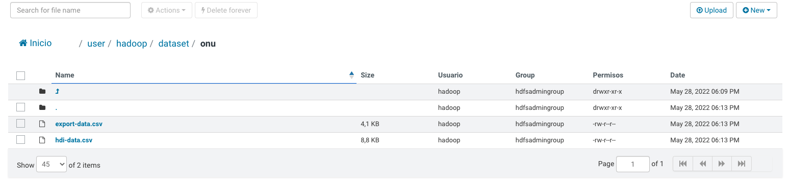

## Files locales desde HUE

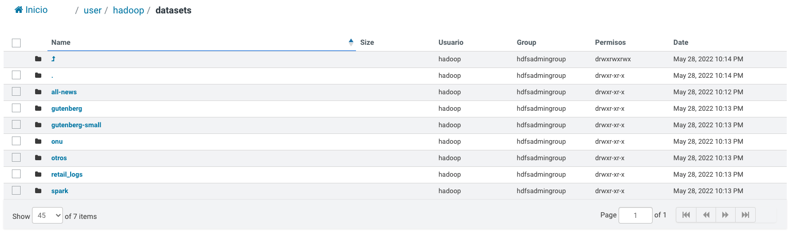

## Lab 1 

Empezamos por crear un usuario en hadoop desde la consola de comandos de la siguiente manera. 
(Recordatorio) Es importante acceder a permisos especiales con sudo su

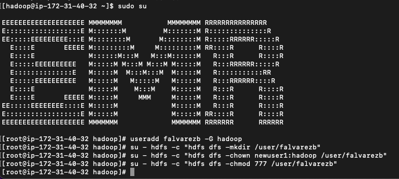

Después de eso accedemos al usuario y con sudo su falvarezb que fue el usuario que creamos anteriormente y creamos el directorio de datasets con las carpetas de los archivos y los datos que vamos a guardar

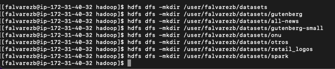

